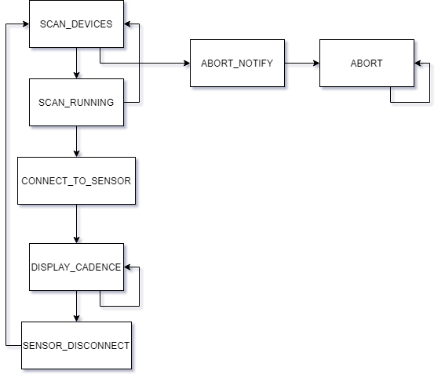

- [Architecture](#architecture)
  - [Design](#design)
    - [Initialization](#initialization)
    - [State Flow](#state-flow)
      - [SCAN_DEVICES](#scan_devices)
      - [SCAN_RUNNING](#scan_running)
      - [CONNECT_TO_SENSOR](#connect_to_sensor)
      - [DISPLAY_CADENCE](#display_cadence)
      - [SENSOR_DISCONNECT](#sensor_disconnect)
      - [ABORT_NOTIFY](#abort_notify)
      - [ABORT](#abort)

# Architecture

## Design

The software is implemented as a state machine.  During `setup`, the application's `initialize` method is called.  After setup, `loop` calls the applications `step`, where all state and logic will be executed.

### Initialization

During the `initialize`, the application will set up the display, connecting to it over I2C using the default address.  Next, the BLE stack is initialized and certain scan settings are set, including registering the class as the callback for `onResult` of a BLE advertised device being found.

### State Flow

#### SCAN_DEVICES

The first order of business is to locate the cadence sensor.  During `SCAN_DEVICES` the BLE scan is started with a callback registered for the completion of the scan.

The scan will run at most 10 times, for 30 seconds per scan.

If the scan has happened 10 or fewer times, the state will transition to `SCAN_RUNNING`.

If the scan has happened 11 or more times, the state will transition to `ABORT_NOTIFY`.

#### SCAN_RUNNING

During `SCAN_RUNNING`, the application only outputs some information to the serial interface.

If no devices advertising the CSC service are found during this scan, the state will transition back to `SCAN_DEVICES`.

If a device is found advertising the CSC service, the `onResult` method will transition the state to `CONNECT_TO_SENSOR`.

#### CONNECT_TO_SENSOR

During `CONNECT_TO_SENSOR`, a remote device is connected to and the notify characteristic is set with the notify callback.

If connection fails, the state will transition to `SCAN_DEVICES`.

If the connection succeeds, the state will transition to `DISPLAY_CADENCE`.

#### DISPLAY_CADENCE

During `DISPLAY_CADENCE`, the cadence is displayed, if it has changed.  The cadence is calculated by the notify callback, as sent by the sensor when the characteristic changes.

If the `onDisconnect` callback is called, the state will transition to `SENSOR_DISCONNECT`.

Otherwise, the application is expected to remain in this state until power off.

#### SENSOR_DISCONNECT

During `SENSOR_DISCONNECT`, a serial message is sent to notify the sensor has disconnected.

The state will transition to `SCAN_DEVICES`.

#### ABORT_NOTIFY

The state will transition to `ABORT`, after notifying over serial and on the display of the failure to locate a sensor.

#### ABORT

The state will never transition.
